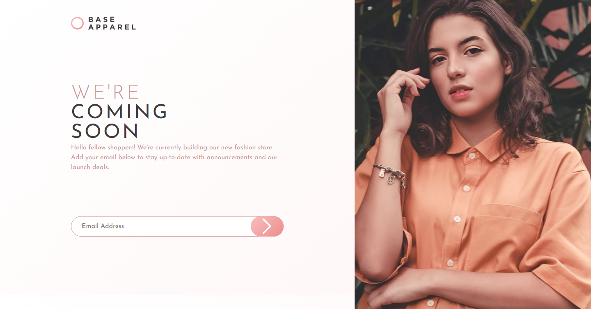

# Frontend Mentor - Base Apparel coming soon page solution

This is a solution to the [Base Apparel coming soon page challenge on Frontend Mentor](https://www.frontendmentor.io/challenges/base-apparel-coming-soon-page-5d46b47f8db8a7063f9331a0). Frontend Mentor challenges help you improve your coding skills by building realistic projects. 

## Overview

### The challenge

Your users should be able to:

- View the optimal layout for the site depending on their device's screen size
- See hover states for all interactive elements on the page
- Receive an error message when the `form` is submitted if:
  - The `input` field is empty
  - The email address is not formatted correctly

### Screenshot

### Links

- Solution URL: [Frontendmentor](https://www.frontendmentor.io/solutions/responsive-landing-page-with-react-js-and-grid-css-layout-csd7YSPtAj)
- Live Site URL: [Github Pages](https://juanmderosa.github.io/base-apparel-coming-soon/)

### Built with

- Semantic HTML5 markup
- CSS custom properties
- Grid Layout
- Mobile First Workflow
- [React](https://reactjs.org/) - JS library

## Author

- Website - [Juan Martín De Rosa](https://juanmderosa-developer.com/)
- Frontend Mentor - [@juanmderosa](https://www.frontendmentor.io/profile/juanmderosa)
- Linkedin - [Juan Martín De Rosa](https://www.linkedin.com/in/juanmderosa/)

